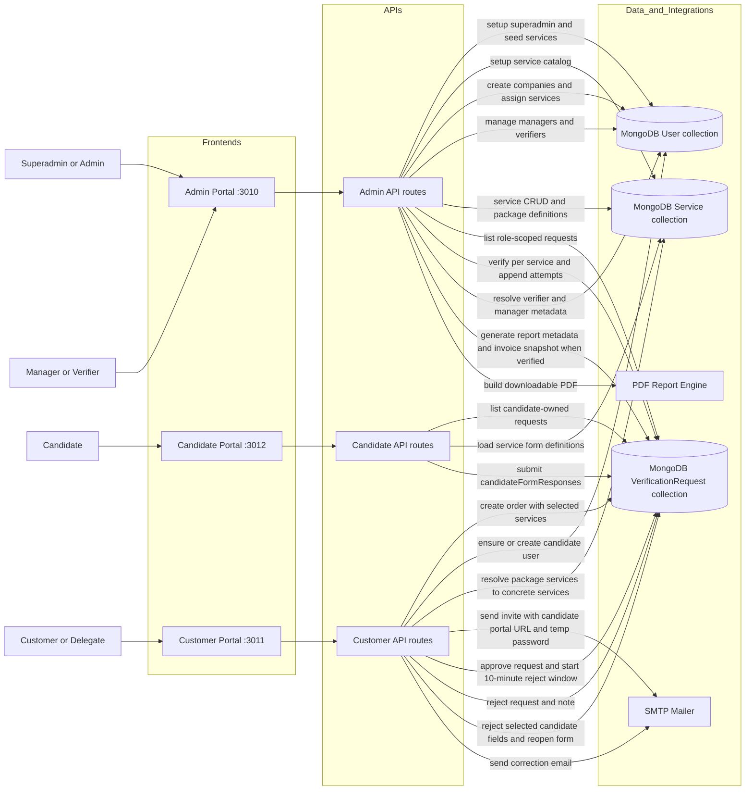

# System Dataflow Diagram

```mermaid
flowchart LR
  %% Actors
  A1[Superadmin or Admin]
  A2[Customer or Delegate]
  A3[Candidate]
  A4[Manager or Verifier]

  %% Frontends
  subgraph Frontends
    F1[Admin Portal :3010]
    F2[Customer Portal :3011]
    F3[Candidate Portal :3012]
  end

  %% API Layers
  subgraph APIs
    P1[Admin API routes]
    P2[Customer API routes]
    P3[Candidate API routes]
  end

  %% Shared Data and Integrations
  subgraph Data_and_Integrations
    D1[(MongoDB User collection)]
    D2[(MongoDB Service collection)]
    D3[(MongoDB VerificationRequest collection)]
    I1[SMTP Mailer]
    I2[PDF Report Engine]
  end

  %% Access
  A1 --> F1
  A2 --> F2
  A3 --> F3
  A4 --> F1

  %% Frontend to API
  F1 --> P1
  F2 --> P2
  F3 --> P3

  %% Setup and master data
  P1 -- setup superadmin and seed services --> D1
  P1 -- setup service catalog --> D2
  P1 -- create companies and assign services --> D1
  P1 -- manage managers and verifiers --> D1
  P1 -- service CRUD and package definitions --> D2

  %% Order creation and candidate onboarding
  P2 -- create order with selected services --> D3
  P2 -- ensure or create candidate user --> D1
  P2 -- resolve package services to concrete services --> D2
  P2 -- send invite with candidate portal URL and temp password --> I1

  %% Candidate form flow
  P3 -- list candidate-owned requests --> D3
  P3 -- load service form definitions --> D2
  P3 -- submit candidateFormResponses --> D3

  %% Enterprise decision flow
  P2 -- approve request and start 10-minute reject window --> D3
  P2 -- reject request and note --> D3
  P2 -- reject selected candidate fields and reopen form --> D3
  P2 -- send correction email --> I1

  %% Admin verification flow
  P1 -- list role-scoped requests --> D3
  P1 -- verify per service and append attempts --> D3
  P1 -- resolve verifier and manager metadata --> D1

  %% Reporting
  P1 -- generate report metadata and invoice snapshot when verified --> D3
  P1 -- build downloadable PDF --> I2
```
