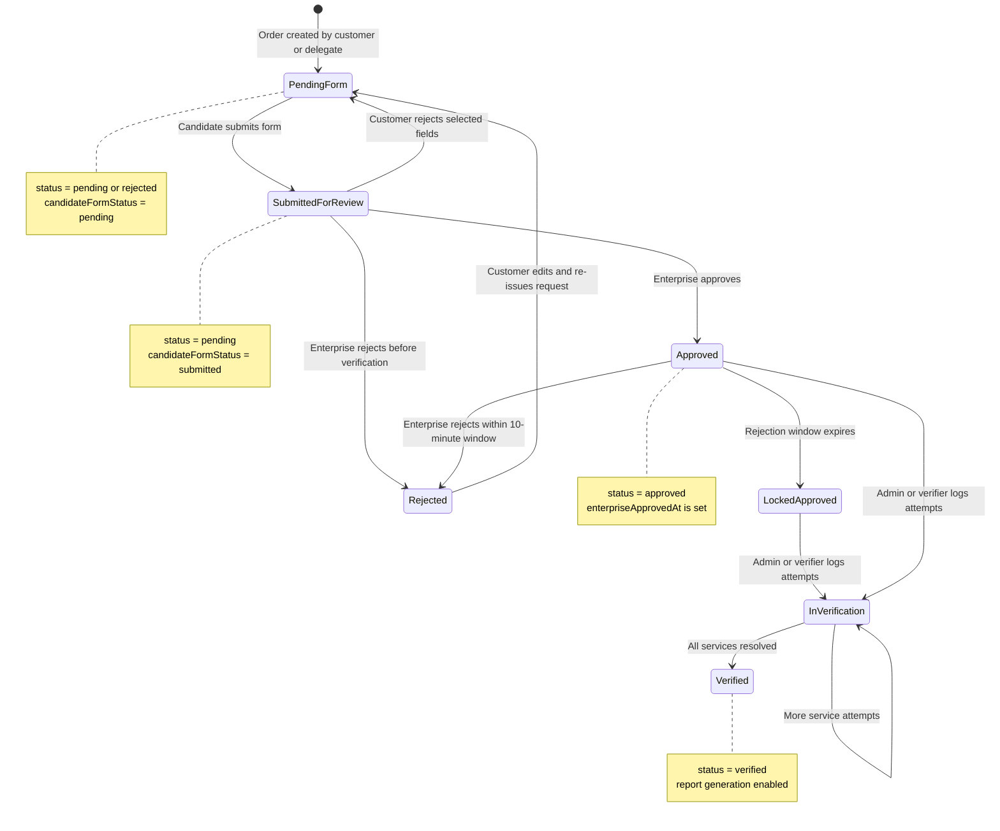

# Request Lifecycle Stateflow

## Practical Reading

- Candidate correction loops move the request back to pending form state.
- Enterprise rejection after approval is time-bound.
- Service-level attempts are tracked until all selected services are verified or unverified.
