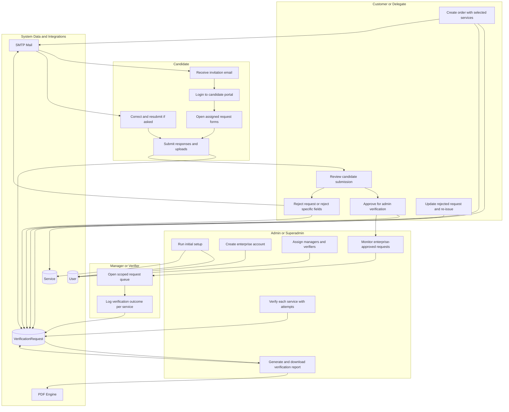

# Role Based Swimlane Workflow

```mermaid
flowchart TB
  %% Swimlane: Admin
  subgraph L1[Admin or Superadmin]
    A1[Run initial setup]
    A2[Create enterprise account]
    A3[Assign managers and verifiers]
    A4[Monitor enterprise-approved requests]
    A5[Verify each service with attempts]
    A6[Generate and download verification report]
  end

  %% Swimlane: Customer
  subgraph L2[Customer or Delegate]
    C1[Create order with selected services]
    C2[Review candidate submission]
    C3[Approve for admin verification]
    C4[Reject request or reject specific fields]
    C5[Update rejected request and re-issue]
  end

  %% Swimlane: Candidate
  subgraph L3[Candidate]
    U1[Receive invitation email]
    U2[Login to candidate portal]
    U3[Open assigned request forms]
    U4[Submit responses and uploads]
    U5[Correct and resubmit if asked]
  end

  %% Swimlane: Manager or Verifier
  subgraph L4[Manager or Verifier]
    V1[Open scoped request queue]
    V2[Log verification outcome per service]
  end

  %% Swimlane: System Data and Integrations
  subgraph L5[System Data and Integrations]
    D1[(User)]
    D2[(Service)]
    D3[(VerificationRequest)]
    E1[SMTP Mail]
    P1[PDF Engine]
  end

  A1 --> D1
  A1 --> D2
  A2 --> D1
  A3 --> D1
  C1 --> D2
  C1 --> D3
  C1 --> E1
  E1 --> U1
  U1 --> U2 --> U3 --> U4
  U4 --> D3
  U4 --> C2

  C2 --> C3
  C2 --> C4
  C3 --> D3
  C3 --> A4

  C4 --> D3
  C4 --> E1
  E1 --> U5
  U5 --> U4
  C5 --> D3

  A4 --> V1
  V1 --> V2
  V2 --> D3
  A5 --> D3

  D3 --> A6
  A6 --> P1
  A6 --> D3
```
