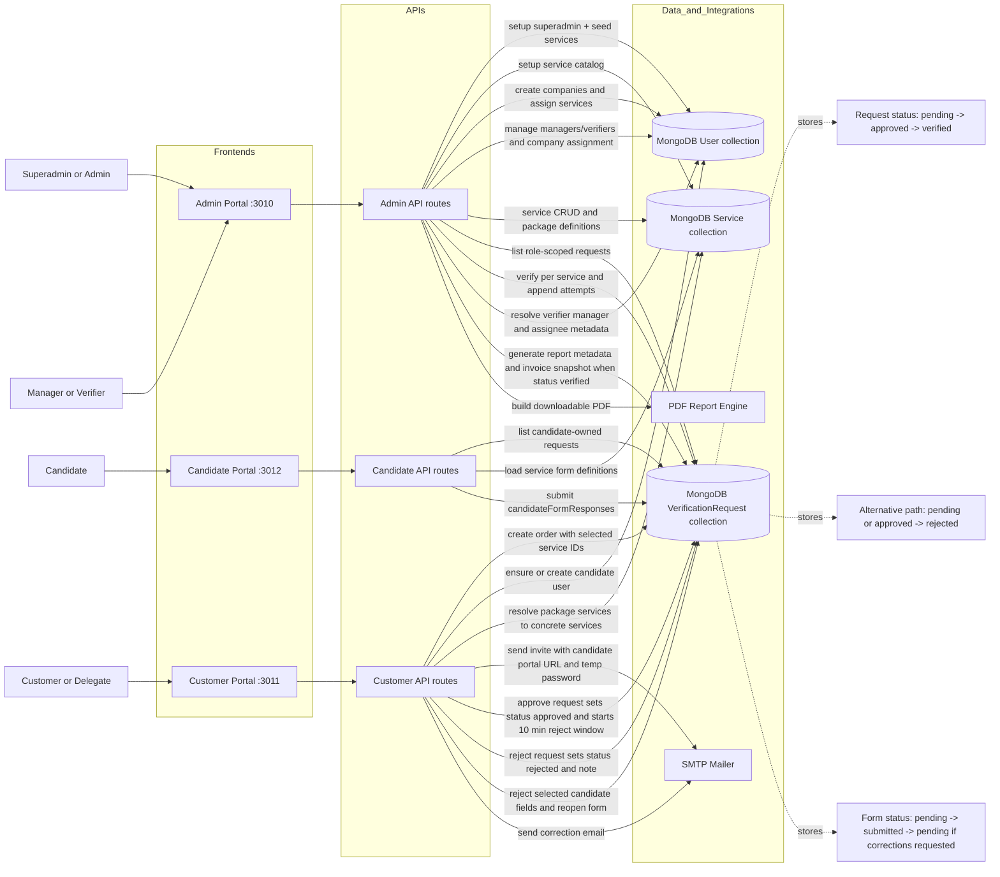
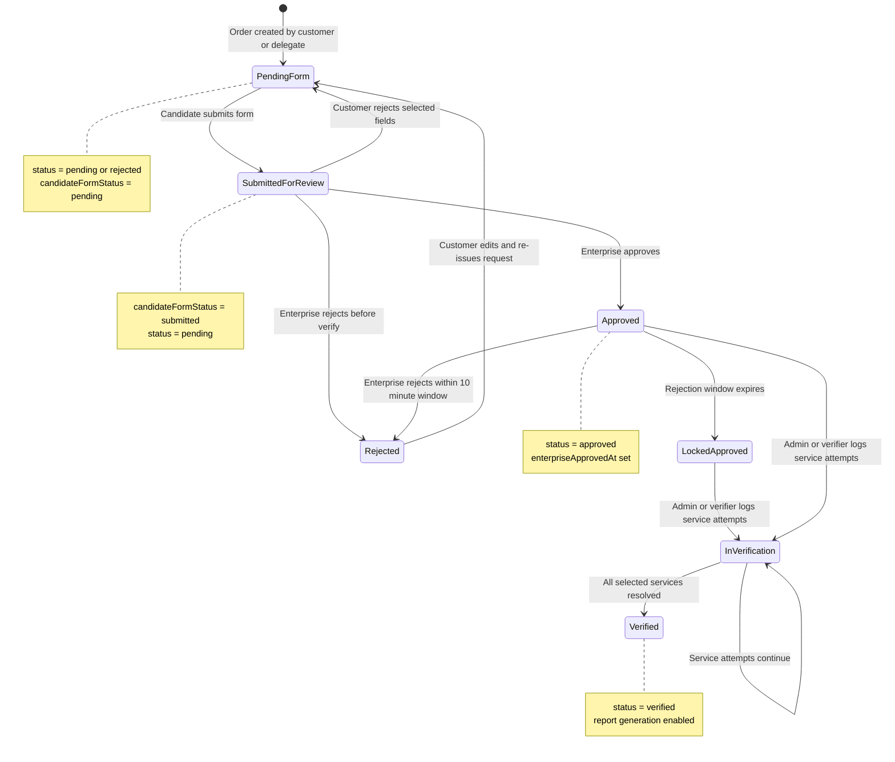
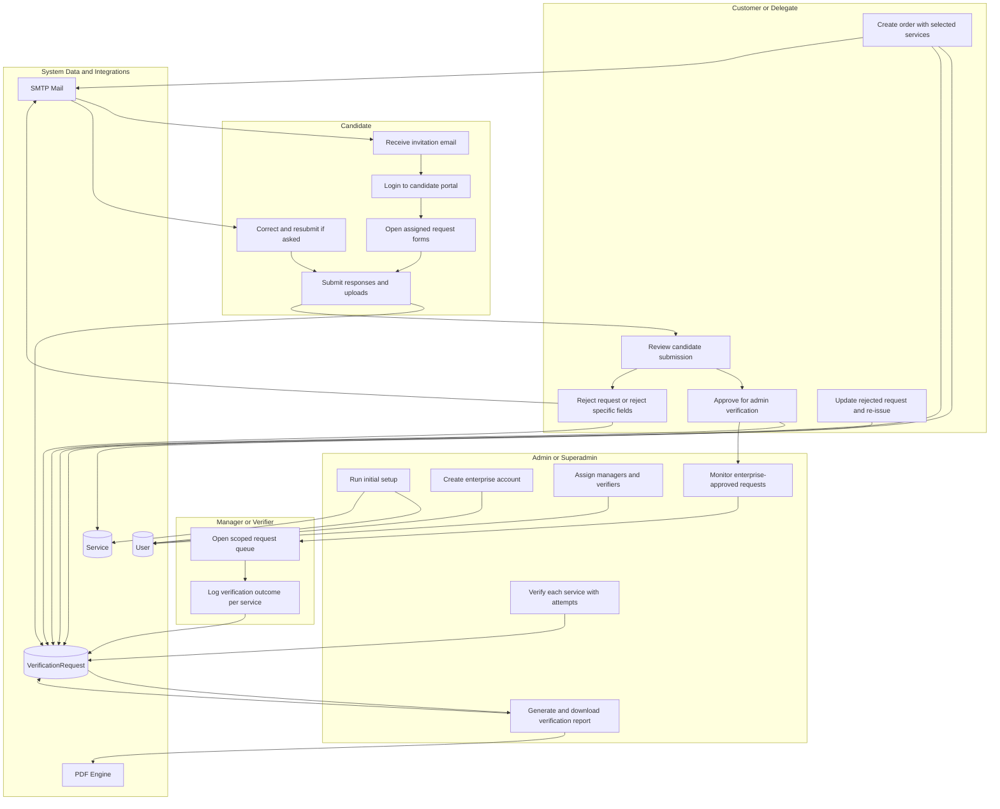

# ClusoCRM Workflow and Dataflow Diagram

## System Dataflow

## Request Lifecycle Stateflow

## Role-Based Swimlane Workflow

## Source-of-truth paths used

- cluso-new-suite/cluso-admin/app/api/requests/route.ts
- cluso-new-suite/cluso-admin/app/api/requests/[requestId]/report/route.ts
- cluso-new-suite/cluso-admin/app/api/customers/route.ts
- cluso-new-suite/cluso-admin/app/api/verifiers/route.ts
- cluso-new-suite/cluso-admin/app/api/services/route.ts
- cluso-new-suite/cluso-admin/app/api/setup/route.ts
- cluso-new-suite/cluso-customer/app/api/orders/route.ts
- cluso-new-suite/cluso-customer/app/api/delegates/route.ts
- cluso-new-suite/cluso-customer/app/api/settings/profile/route.ts
- cluso-new-suite/cluso-candidates/app/api/requests/route.ts
- cluso-new-suite/cluso-admin/lib/models/VerificationRequest.ts
- cluso-new-suite/cluso-customer/lib/models/User.ts
- cluso-new-suite/cluso-admin/lib/models/Service.ts
